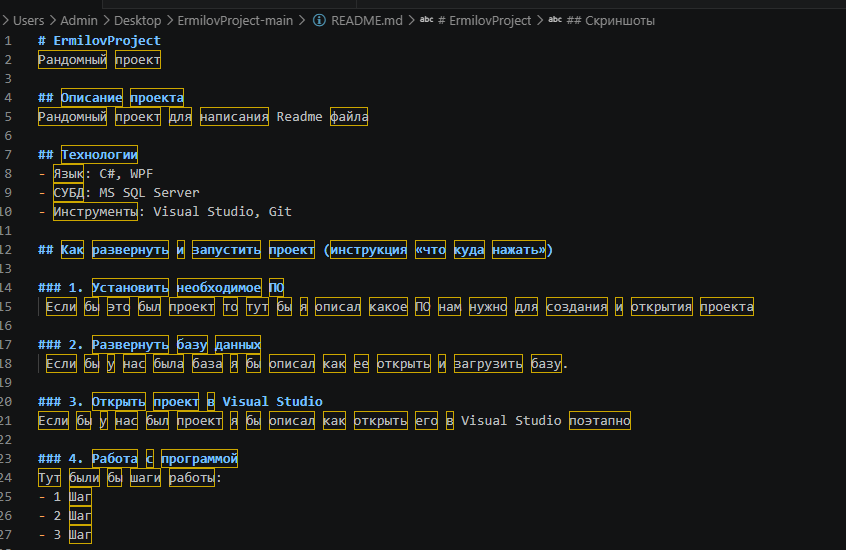
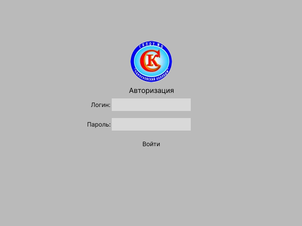

# ErmilovProject
 это учебно-демонстрационный проект, созданный в рамках знакомства с процессом разработки программного обеспечения и оформления технической документации. Несмотря на название, проект не претендует на какую-либо уникальную бизнес-логику или промышленное применение, а служит, в первую очередь, полигоном для отработки навыков написания качественного README-файла, работы с системой контроля версий Git, а также взаимодействия между клиентским приложением и реляционной базой данных.

Проект представляет собой шаблон, который в будущем может быть наполнен реальной функциональностью, например, учётом задач, ведением журнала событий или простейшей CRM-системой. На данный момент вся ценность проекта заключается в его структуре, чистоте кода (в перспективе) и наглядности документации.

## Описание проекта
Рандомный проект для написания Readme файла

## Технологии
- Язык: C#, WPF
- СУБД: MS SQL Server 
- Инструменты: Visual Studio, Git
- В рамках данного проекта предполагается использование следующего стека технологий и инструментов:
- Язык программирования: C# (.NET, предположительно версии 6.0 и выше)
- Платформа для графического интерфейса: WPF (Windows Presentation Foundation)
- Система управления базами данных: MS SQL Server (версии 2019 или 2022, включая SQL Server Express)
- Среда разработки: Visual Studio (рекомендуется 2022 Community или Professional)
- Система контроля версий: Git (через командную строку, PowerShell или встроенные средства Visual Studio)

## Как развернуть и запустить проект (инструкция «что куда нажать»)
Ниже представлено подробное, пошаговое руководство для человека, который, возможно, впервые видит Visual Studio и базы данных. Все действия описаны максимально доступно, с пояснениями на случай, если что-то пошло не так.

### 1. Установить необходимое ПО
Если бы это был реальный проект, который уже написан и ждёт своего часа, то для его запуска потребовалось бы предварительно установить следующий набор программного обеспечения:

- Visual Studio 2022 (любая редакция, включая бесплатную Community). При установке обязательно выбрать компоненты:

- «Разработка классических приложений .NET»

- «Хранилище данных и обработка» (для работы с SQL Server)

- «Git для Windows» (встроенный инструмент)

- MS SQL Server (например, Developer или Express Edition). Можно также установить SQL Server LocalDB — облегчённую версию для разработки.

- SQL Server Management Studio (SSMS) — графический инструмент для работы с базами данных (опционально, но настоятельно рекомендуется).

- Git (отдельно, если не устанавливался вместе с Visual Studio) — для клонирования репозитория и управления версиями.

Все эти программы распространяются бесплатно или имеют бесплатные редакции, достаточные для разработки и локального тестирования.

### 2. Развернуть базу данных
Если бы у нас в проекте была база данных (например, для хранения пользователей, заказов или логов), то процедура её развёртывания выглядела бы следующим образом:

- Запустить SQL Server Management Studio или встроенную среду Visual Studio («Обозреватель объектов SQL Server»).

- Подключиться к вашему экземпляру SQL Server (обычно localhost или .\SQLEXPRESS).

- Открыть файл скрипта инициализации базы данных, который, по задумке, должен лежать в папке database/ репозитория (например, init.sql).

- Выполнить скрипт полностью или по частям, предварительно убедившись, что база данных с таким именем не существует (или наоборот — пересоздать её через DROP DATABASE IF EXISTS).

- Проверить создание таблиц, индексов и, возможно, хранимых процедур через раздел «Таблицы» в SSMS.

- При необходимости — заполнить таблицы тестовыми данными с помощью команды INSERT или отдельного скрипта seed.sql.

- После успешного выполнения этих шагов база данных готова к подключению из приложения.

### 3. Открыть проект в Visual Studio
Если бы у нас уже был готовый исходный код проекта, то порядок действий для его открытия и первой сборки выглядел бы так (при условии, что репозиторий уже склонирован на компьютер):

- Запустить Visual Studio любым удобным способом (через меню «Пуск», поиск или иконку на рабочем столе).

- В стартовом окне выбрать опцию «Открыть проект или решение» (Open a project or solution).

- В появившемся диалоговом окне проводника перейти в папку, куда был склонирован репозиторий ErmilovProject.

- Найти и выбрать файл с расширением .sln (например, ErmilovProject.sln).

- Нажать кнопку «Открыть».

- Дождаться, пока Visual Studio загрузит все проекты, зависимости и пакеты NuGet (внизу справа может отображаться индикация восстановления пакетов).

- Убедиться, что в выпадающем списке конфигурации сборки выбрано значение Debug, а архитектура — Any CPU или x64.

- Нажать клавишу F5 (или кнопку «Запуск» с зелёным треугольником на панели инструментов) для компиляции и запуска проекта в режиме отладки.
## Скриншоты
!() 

.png)

## Word

## Автор
Ермилов Никита 1231 
Группа
1231

